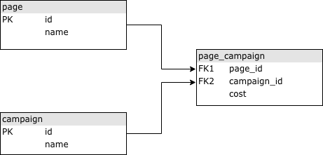

## Respuestas al Test

### 2a

Para el desarrollo de este requerimiento utilizaría el componente de Symfony llamado 
["The DomCrawler Component"](https://symfony.com/doc/current/components/dom_crawler.html) en
conjunto con el paquete "symfony/css-selector" el cual sirve para seleccionar nodos de un XML por atributos.

La idea de usar este componente es que fácilmente se puede instanciar el crawler y filtrar por un nodo en específico. 
Al filtrar, este devuelve un array el cual podemos recorrer fácilmente para obtener el contenido del nodo "heading"
 
### 3a
Las funciones include y require sirven para incluir o importar el contenido de ficheros. Principalmente se utilizan
para separar funcionalidades en busca de estructurar mejor el proyecto, es decir, estandarizar aquellas partes del 
código que son utilizadas en distintas partes del codigo y aplicar la premisa de "Don't repeat yourself".

### 3b
Si un fichero no existe cuando se intenta usar la función "include", php arrojará un warning indicando que no se pudo 
incluir el fichero puesto que no se encuentra o no existe. Si se utiliza require, php arrojará un PHP Fatal Error y se 
detendrá la ejecución del código.

### 3c
La diferencia que tiene require e include en comparación de require_once e include_once es que estas dos últimas funcionan
de la misma manera de cada una, con la facultad de que si el fichero existe, verificará que no haya sido incluido o requerido
previamente.

### 4
a = 17
b = 3
c = 7

### CONOCIMIENTOS JAVASCRIPT Y JQUERY
- 1-  A través del método: getElementById("id");
```Javascript
document.getElementById("btnSend");
```
- 2- A través del método: getElementsByClassName("class");
```Javascript
document.getElementsByClassName("col-sm-10");
```
- 3- Utilizando los selectores de jQuery seria de la siguiente forma:
```Javascript
$('.class') # Para seleccionar por clase css
$('#id') # Para seleccionar por Id
```
- 4- Utilizando el método .each()
```javascript
var arrElementos = [ "uno", "dos", "tres", "cuatro", "cinto" ];
$.each( arrElementos, function( i, val ) {
  console.log('El elemento ' + i + ' tiene valor de: ' + val);
});
``` 
- 5- Utilizando el método .get(), o .post() o .ajax según se necesite:
```javascript
var request = $.get( "mi_ejemplo.php", function() {
})
  .done(function() {
    alert( "exito" );
  })
  .fail(function() {
    alert( "error" );
  });
```

## PRUEBA NIVEL DE DESARROLLO

### CONOCIMIENTOS DE BASES DE DATOS
- 1- Estructura de la BD



SQL DE LA ESTRUCTURA DEFINIDA:
```sql
CREATE TABLE page (
`id` INT(11) NOT NULL AUTO_INCREMENT PRIMARY KEY,
name VARCHAR(100) NOT NULL
);

CREATE TABLE campaign (
`id` INT(11) NOT NULL AUTO_INCREMENT PRIMARY KEY,
name VARCHAR(100) NOT NULL
);

CREATE TABLE page_campaign (
`page_id` INT(11) NOT NULL,
`campaign_id` INT(11) NOT NULL,
`cost` DECIMAL(10,2) NOT NULL,
CONSTRAINT PK_PAGE_CAMPAIGN PRIMARY KEY (page_id, campaign_id)
);
```
INSERTS DE DATOS
```sql
-- Tabla page
INSERT INTO wptest.page (id, name) VALUES (1, 'Pagina 1');
INSERT INTO wptest.page (id, name) VALUES (2, 'Pagina 2');
INSERT INTO wptest.page (id, name) VALUES (3, 'Pagina 3');

-- Tabla campaign
INSERT INTO wptest.campaign (id, name) VALUES (1, 'Campaña 1');
INSERT INTO wptest.campaign (id, name) VALUES (2, 'Campaña 2');
INSERT INTO wptest.campaign (id, name) VALUES (3, 'Campaña 3');
INSERT INTO wptest.campaign (id, name) VALUES (4, 'Campaña 4');
INSERT INTO wptest.campaign (id, name) VALUES (5, 'Campaña 5');

-- Tabla page_campaign
INSERT INTO wptest.page_campaign (page_id, campaign_id, cost) VALUES (1, 1, 170.00);
INSERT INTO wptest.page_campaign (page_id, campaign_id, cost) VALUES (1, 2, 190.00);
INSERT INTO wptest.page_campaign (page_id, campaign_id, cost) VALUES (1, 4, 220.00);
INSERT INTO wptest.page_campaign (page_id, campaign_id, cost) VALUES (2, 1, 140.00);
INSERT INTO wptest.page_campaign (page_id, campaign_id, cost) VALUES (2, 2, 240.00);
INSERT INTO wptest.page_campaign (page_id, campaign_id, cost) VALUES (2, 5, 146.00);
INSERT INTO wptest.page_campaign (page_id, campaign_id, cost) VALUES (3, 1, 290.00);
INSERT INTO wptest.page_campaign (page_id, campaign_id, cost) VALUES (3, 3, 199.00);
INSERT INTO wptest.page_campaign (page_id, campaign_id, cost) VALUES (3, 4, 100.00);

```
- 2- Listado de nombres de páginas y campañas asociadas
```sql
SELECT 
    p.name AS 'Pagina',
    c.name AS 'Campaña' 
FROM 
    page_campaign pc 
INNER JOIN 
    page p ON p.id = pc.page_id 
INNER JOIN 
    campaign c ON c.id = pc.campaign_id 
```
- 3- Coste total de cada una de las campañas en todas las páginas del sistema
```sql
SELECT 
    c.name AS 'Campaña',
    SUM(pc.cost AS 'Coste total')
FROM 
    page_campaign pc 
INNER JOIN 
    page p ON p.id = pc.page_id 
INNER JOIN 
    campaign c ON c.id = pc.campaign_id
GROUP BY 
    pc.campaign_id
```

### CONOCIMIENTOS UNIX

### CONOCIMIENTOS SYMFONY

1. b y c
1. b y d
1. a y b
1. a
1. b
1. c